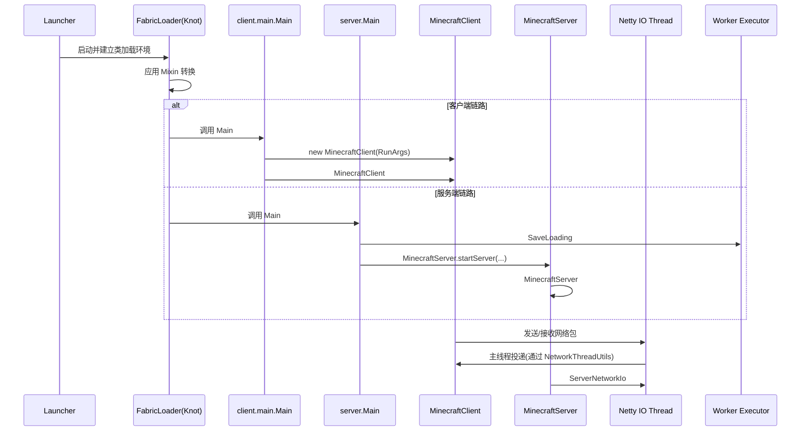
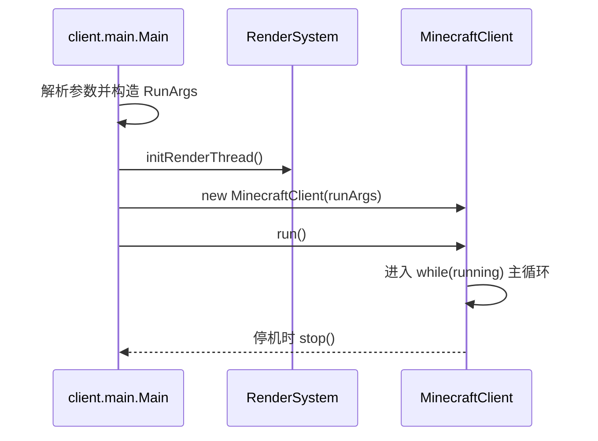
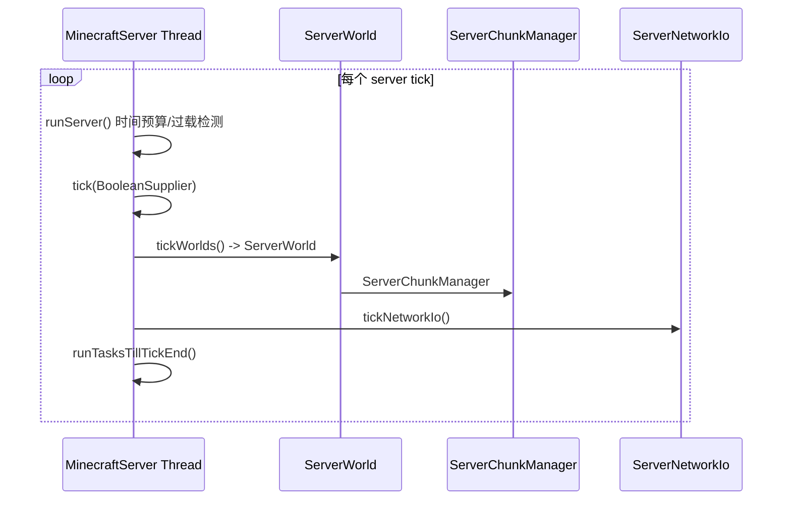
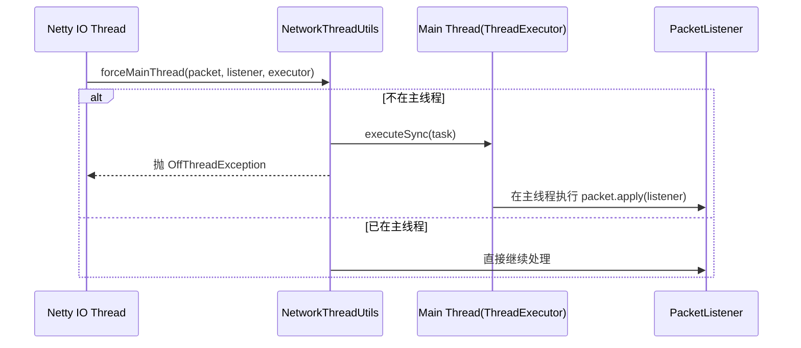

# Minecraft 1.21.6 本体运行逻辑解析（Fabric 链路版）

## 1. 版本与分析边界

### 1.1 基线版本（来自当前工程）

| 项 | 值 |
|---|---|
| Minecraft | `1.21.6` |
| Yarn 映射 | `1.21.6+build.1` (`v2`) |
| Fabric Loader | `0.18.4` |
| Fabric API | `0.128.2+1.21.6` |
| Java | `21` |

版本来源对应当前仓库的 `gradle.properties` 与运行参数缓存（`build/loom-cache/argFiles/*`）。

### 1.2 分析数据来源

- 本文以当前工程本地 `minecraft-merged-...-1.21.6-...-yarn...jar` 为事实源。
- 类名与方法名使用 Yarn 命名（例如 `net.minecraft.client.MinecraftClient#run`）。
- 方法体级推断基于 `javap -c -p` 反汇编结果。

### 1.3 边界声明（本体逻辑 vs Loader 逻辑）

- `Fabric Loader` 负责启动引导、类加载与 Mixin 织入。
- `Minecraft 本体` 负责主循环、世界/区块、渲染、网络、资源重载与异常处理。
- 本文会先交代 Fabric 链路到达本体入口，再把重点放在本体代码运行机制。

## 2. 启动总览（Fabric 启动链 -> Minecraft 入口）

### 2.1 双入口概览

| 场景 | 本体入口锚点 | 关键职责 |
|---|---|---|
| 客户端 | `net.minecraft.client.main.Main#main` | 解析启动参数，构造 `RunArgs`，创建并运行 `MinecraftClient` |
| 服务端 | `net.minecraft.server.Main#main` | 解析 server 参数，校验世界与数据包，启动 `MinecraftServer` |

### 2.2 全局时序总图

## 3. 客户端启动链（`client.main.Main` -> `MinecraftClient` 初始化）

### 3.1 入口方法与参数装配

`net.minecraft.client.main.Main#main` 主要做了四类事情：

1. 用 `joptsimple.OptionParser` 解析参数（分辨率、资产目录、账号、版本、QuickPlay 等）。
2. 组装 `RunArgs`（`RunArgs.Network` / `WindowSettings` / `RunArgs.Directories` / `RunArgs.Game` / `RunArgs.QuickPlay`）。
3. 完成渲染线程初始化：`RenderSystem.initRenderThread`。
4. 创建并运行客户端实例：`new MinecraftClient(runArgs)` -> `MinecraftClient#run`。

### 3.2 客户端启动关键调用链

| 顺序 | 调用点 |
|---|---|
| 1 | `net.minecraft.client.main.Main#main` |
| 2 | `RenderSystem.initRenderThread` |
| 3 | `net.minecraft.client.MinecraftClient#<init>` |
| 4 | `net.minecraft.client.MinecraftClient#run` |
| 5 | 退出阶段 `MinecraftClient#scheduleStop` / `MinecraftClient#stop` |

### 3.3 客户端启动时序图

## 4. 客户端主循环（`MinecraftClient.run/render/tick`）

### 4.1 外层循环

`net.minecraft.client.MinecraftClient#run` 的骨架是：

- 记录当前线程为客户端线程。
- `while (running)` 中持续调用 `MinecraftClient#render(boolean)`。
- 在循环中处理 `CrashException`、`Throwable`、`OutOfMemoryError`。

### 4.2 `render(boolean)`：一帧中的调度与渲染

`net.minecraft.client.MinecraftClient#render(boolean)` 包含：

1. 窗口阶段标记与关闭检查（`Window#setPhase` / `Window#shouldClose`）。
2. 渲染任务队列执行（`renderTaskQueue.poll()`）。
3. Tick 预算推进（`RenderTickCounter.Dynamic#beginRenderTick`）。
4. 当允许逻辑推进时，最多执行 `min(10, accumulatedTicks)` 次 `MinecraftClient#tick`。
5. 调用 `GameRenderer#render` 进行世界+GUI渲染。
6. `Framebuffer#blitToScreen` + `Window#swapBuffers` + FPS/暂停状态更新。

### 4.3 `tick()`：客户端逻辑帧

`net.minecraft.client.MinecraftClient#tick` 的关键路径：

- UI 与教程：`InGameHud#tick`、`TutorialManager#tick`。
- 交互管理：`ClientPlayerInteractionManager#tick`。
- 当前屏幕：`Screen#tick`（若有）。
- 世界逻辑：`ClientWorld#tick(BooleanSupplier)`。
- 实体逻辑：`ClientWorld#tickEntities()`。
- 渲染侧逻辑：`GameRenderer#tick`、`WorldRenderer#tick`。
- 网络心跳：发送 `ClientTickEndC2SPacket`（经 `ClientPlayNetworkHandler#sendPacket`）。

### 4.4 客户端主循环的线程语义

- `MinecraftClient` 继承 `ReentrantThreadExecutor`，自身线程是“逻辑主线程 + 渲染主线程（客户端单线程模型）”。
- 其他线程（网络/资源加载）通过任务投递回客户端线程执行关键状态修改。

## 5. 渲染管线（`GameRenderer.render/renderWorld` + `WorldRenderer.render/renderMain`）

### 5.1 `GameRenderer#render`

`net.minecraft.client.render.GameRenderer#render(RenderTickCounter, boolean)` 负责：

- 焦点丢失时暂停策略。
- 更新全局渲染设置（尺寸、时间、特效参数）。
- 进入世界渲染：`GameRenderer#renderWorld`。
- 渲染 HUD、Overlay、当前 Screen（或菜单背景）。
- 对异常分支产出 `CrashReport`（例如 overlay/screen 渲染出错）。

### 5.2 `GameRenderer#renderWorld`

核心职责：

1. 相机更新、投影矩阵构造、FOV/摇晃/眩晕处理。
2. 雾参数计算（`FogRenderer`）。
3. 调用 `WorldRenderer#render` 完成世界主体绘制。
4. 渲染手持物与屏幕特效。

### 5.3 `WorldRenderer#render` 与 `#renderMain`

`net.minecraft.client.render.WorldRenderer#render(...)` 的主要阶段：

- Light 更新队列与 `LightingProvider#doLightUpdates`。
- 视锥体准备与实体可见性筛选。
- 地形设置与区块编译更新。
- 构建 `FrameGraph`，分配主缓冲/半透明/粒子/天气等 framebuffer handle。
- 进入 `WorldRenderer#renderMain(...)` 执行主通道。
- 后处理、粒子、云、天气、late debug pass。

`WorldRenderer#renderMain(...)` 的关键点：

- 在 framegraph 主 pass 中转接各 framebuffer。
- 绑定主渲染 runnable（内部会做地形层、实体、方块实体等绘制）。
- 按条件接入实体轮廓缓冲等后处理通道。

## 6. 服务端启动链（`server.Main` -> `SaveLoading` -> `MinecraftServer.startServer`）

### 6.1 `server.Main#main` 的启动职责

`net.minecraft.server.Main#main` 关键流程：

1. 参数解析（`nogui`、`safeMode`、`forceUpgrade`、`port` 等）。
2. `server.properties` / `eula.txt` 初始化与校验。
3. 打开世界存档（`LevelStorage#createSession`），读取 `level.dat`。
4. 世界数据容错：读主文件失败时尝试旧备份；双失败则停止。
5. 创建数据包管理与服务器配置（`createServerConfig`）。
6. 通过 `SaveLoading#load` 异步加载 `SaveLoader`。
7. `MinecraftServer.startServer(...)` 创建 `MinecraftDedicatedServer` 并注册停机钩子。

### 6.2 服务端启动关键调用链

| 顺序 | 调用点 |
|---|---|
| 1 | `net.minecraft.server.Main#main` |
| 2 | `net.minecraft.world.level.storage.LevelStorage#createSession` |
| 3 | `net.minecraft.server.SaveLoading#load` |
| 4 | `net.minecraft.server.MinecraftServer#startServer` |
| 5 | `net.minecraft.server.MinecraftServer#runServer` |

## 7. 服务端主循环（`MinecraftServer.runServer/tick/tickWorlds`）

### 7.1 `MinecraftServer#runServer`

`net.minecraft.server.MinecraftServer#runServer` 是服务端外层循环，关键机制：

- 启动前执行 `setupServer`，并加载 favicon/metadata。
- 每次循环计算目标 tick 时间；过载时打印 `Can't keep up!` 警告并追赶时钟。
- 调用 `MinecraftServer#tick(BooleanSupplier)`。
- 在 tick 末尾执行 `runTasksTillTickEnd`，处理队列任务直到下一个 tick 边界。

### 7.2 `MinecraftServer#tick(BooleanSupplier)`

关键路径：

- 空服暂停策略（按 `getPauseWhenEmptySeconds`）。
- `ServerTickManager#step`。
- `MinecraftServer#tickWorlds(BooleanSupplier)`。
- 自动保存计数（`ticksUntilAutosave`）与平均 tick 时间统计。

### 7.3 `MinecraftServer#tickWorlds(BooleanSupplier)`

世界级逻辑顺序（核心）：

1. 命令函数：`CommandFunctionManager#tick`。
2. 遍历世界：每 20 tick 调 `sendTimeUpdatePackets(world)`，再 `ServerWorld#tick`。
3. 网络层：`tickNetworkIo()`。
4. 玩家延迟更新：`PlayerManager#updatePlayerLatency`。
5. 测试框架 tick（若启用）。
6. GUI tickables。
7. 区块批量发送：`ServerPlayNetworkHandler.chunkDataSender.sendChunkBatches`。

### 7.4 服务端 tick 时序图

## 8. 世界与区块调度（`ServerWorld.tick`、`ServerChunkManager.tick/tickChunks`、`ClientWorld.tick`）

### 8.1 服务端世界 tick（`ServerWorld#tick`）

`net.minecraft.server.world.ServerWorld#tick(BooleanSupplier)` 的相对顺序可概括为：

1. 世界边界与天气。
2. 睡眠跳夜与时间推进（含 `DO_DAYLIGHT_CYCLE` / `DO_WEATHER_CYCLE` 逻辑）。
3. Pending ticks：`blockTickScheduler.tick` -> `fluidTickScheduler.tick`。
4. Raid 与 ChunkSource：调用 `ServerChunkManager#tick`。
5. 同步方块事件处理。
6. 实体迭代与实体管理器 tick。
7. 方块实体 tick。

### 8.2 服务端区块管理（`ServerChunkManager`）

`net.minecraft.server.world.ServerChunkManager#tick(BooleanSupplier,boolean)` 关键步骤：

- `ChunkTicketManager#tick`（票据/加载级别维护）。
- `updateChunks()`（holder map 与 chunk 状态推进）。
- `tickChunks()`（刷怪、随机刻、区块实体/方块刻）。
- `ServerChunkLoadingManager#tick`（卸载与 I/O 流程）。

其中 `tickChunks(Profiler, long)` 会：

- 建立 `SpawnHelper.Info`。
- 计算可刷怪群组并收集 `spawningChunks`。
- 对刷怪区块洗牌后逐块 `tickSpawningChunk(...)`。
- 对 block-ticking chunks 执行随机刻与方块逻辑。
- 执行 `ServerWorld#tickSpawners`（自定义刷怪器）。

### 8.3 客户端世界 tick（`ClientWorld`）

`net.minecraft.client.world.ClientWorld#tick(BooleanSupplier)` 逻辑相对轻量：

- `WorldBorder#tick`。
- 亮度与时间推进（`tickTime`）。
- 客户端区块管理 `ClientChunkManager#tick`。

实体与方块实体由 `ClientWorld#tickEntities` 独立推进，通常由 `MinecraftClient#tick` 触发。

### 8.4 “实体 tick / 区块 tick / 随机刻 / 刷怪 / 区块发送”先后关系

| 顺序层级 | 发生位置 | 说明 |
|---|---|---|
| 1 | `ServerWorld#tick` 内部 | 先推进世界级逻辑与 pending block/fluid tick |
| 2 | `ServerChunkManager#tick` | 推进区块加载、刷怪、随机刻、区块内逻辑 |
| 3 | `ServerWorld` 实体阶段 | 实体迭代与实体管理器处理 |
| 4 | `MinecraftServer#tickWorlds` 尾部 | `chunkDataSender.sendChunkBatches` 发送区块到玩家 |

## 9. 网络线程与主线程切换（`ClientConnection`、`ServerNetworkIo`、`NetworkThreadUtils.forceMainThread`）

### 9.1 线程角色

- Netty I/O 线程：收发包（`ClientConnection` pipeline）。
- 逻辑主线程：客户端 `MinecraftClient` 线程 / 服务端 `MinecraftServer` 线程。
- 约束：涉及世界与游戏状态的包处理必须回到逻辑主线程执行。

### 9.2 主线程强制切换机制

`net.minecraft.network.NetworkThreadUtils#forceMainThread(packet, listener, executor)` 的行为：

1. 若当前不在目标线程（`ThreadExecutor#isOnThread == false`）。
2. 则通过 `ThreadExecutor#executeSync` 投递处理任务。
3. 立即抛出 `OffThreadException.INSTANCE`，终止当前 I/O 线程路径。

这保证包处理“逻辑执行”不会在错误线程上直接修改世界状态。

### 9.3 网络时序图（线程切换）

### 9.4 与连接管理对应关系

- 客户端连接对象：`net.minecraft.network.ClientConnection#tick`。
- 服务端连接管理：`net.minecraft.server.ServerNetworkIo#tick`（轮询连接并推进）。

## 10. 单机集成服特殊行为（`IntegratedServer.tick`）

`net.minecraft.server.integrated.IntegratedServer` 是 `MinecraftServer` 子类，其 `tick(BooleanSupplier)` 有几个关键差异：

1. 每 tick 同步客户端暂停状态：`MinecraftClient.getInstance().isPaused()`。
2. 从“未暂停 -> 暂停”时触发自动保存（日志 `Saving and pausing game...` + `saveAll(false,false,false)`）。
3. 暂停且仍有本地网络连接时，不推进完整世界 tick，只增量统计时间（`incrementTotalWorldTimeStat`）。
4. 恢复运行时主动 `sendTimeUpdatePackets`。
5. 动态同步视距/模拟距离（取客户端设置与最小值约束后写入 `PlayerManager`）。

与客户端侧 `MinecraftClient#startIntegratedServer` 组合后，构成“客户端驱动 + 服务器同进程”的单机模式。

## 11. 资源重载与数据包（`MinecraftClient.reloadResources`、`ReloadableResourceManagerImpl`、`SaveLoading`）

### 11.1 客户端资源重载路径

- `MinecraftClient#reloadResources()` 会进入 `reloadResources(boolean, LoadingContext)`。
- 若已有 `resourceReloadFuture` 则直接复用，避免并发重载。
- 扫描资源包：`ResourcePackManager#scanPacks`。
- 调 `ReloadableResourceManagerImpl#reload(...)`，并挂载 `SplashOverlay` 显示重载进度。

### 11.2 服务端数据包加载路径

- `server.Main#main` 组装 `SaveLoading.ServerConfig` 后调用 `SaveLoading#load`。
- `SaveLoading#load` 产出 `SaveLoader`（包含 `resourceManager`、`dataPackContents`、`combinedDynamicRegistries`、`saveProperties`）。
- 失败时会在启动阶段直接中止并给出数据包相关日志。

### 11.3 “手动重载”和“启动重载”共性

- 共用 `ReloadableResourceManagerImpl#reload` 机制。
- 仅触发原因和 UI 呈现上下文不同（启动加载场景通常由初始化/overlay 驱动）。

## 12. 模组注入切点说明（当前项目）

### 12.1 `ModInitializer` 入口

- 文件：`src/main/java/com/noborder/NoBorder.java`
- 入口：`com.noborder.NoBorder#onInitialize`
- 生命周期位置：Fabric 完成加载并到达“可初始化模组”阶段后执行。

### 12.2 Mixin 注入点

- 文件：`src/main/java/com/noborder/mixin/ExampleMixin.java`
- 目标：`@Mixin(MinecraftServer.class)`
- 注入：`@Inject(method = "loadWorld", at = @At("HEAD"))`

对应本体锚点：`net.minecraft.server.MinecraftServer#loadWorld`。

这意味着当前示例 Mixin 的逻辑会在服务器世界加载流程起点触发，位于 `createWorlds / prepareStartRegion` 之前。

### 12.3 项目切点与本体生命周期映射

| 项目切点 | 本体锚点 | 时机 |
|---|---|---|
| `NoBorder#onInitialize` | Fabric mod init 阶段 | 游戏运行主循环之前 |
| `ExampleMixin#init` | `MinecraftServer#loadWorld` HEAD | 服务端载入世界早期 |

## 13. 故障与崩溃路径（`CrashReport` 与关键异常分支）

下面列出本链路中常见且可定位的方法级异常路径（>=5）：

1. **客户端 OOM**
   - 锚点：`MinecraftClient#run`
   - 分支：`OutOfMemoryError` -> `OutOfMemoryScreen` + 日志 + 尝试继续/停机。

2. **客户端初始化失败**
   - 锚点：`client.main.Main#main`
   - 分支：构造 `MinecraftClient` 或窗口初始化异常 -> `CrashReport.create(...)` -> `MinecraftClient.printCrashReport(...)`。

3. **服务端世界数据损坏**
   - 锚点：`server.Main#main`
   - 分支：`level.dat` 读取失败尝试 `level.dat_old`；双失败则记录“可能损坏”并退出。

4. **数据包加载失败**
   - 锚点：`server.Main#main` + `SaveLoading#load`
   - 分支：`CompletableFuture.get()` 失败 -> 日志提示修复 datapack 或 safeMode 后退出。

5. **服务端运行时未捕获异常**
   - 锚点：`MinecraftServer#runServer`
   - 分支：`createCrashReport` -> 写入 `crash-reports/...` -> `setCrashReport` -> 停服清理。

6. **网络越线程处理保护**
   - 锚点：`NetworkThreadUtils#forceMainThread`
   - 分支：不在主线程时投递任务并抛 `OffThreadException`，强制中断当前线程处理分支。

7. **资源重载失败路径**
   - 锚点：`MinecraftClient#reloadResources(boolean, LoadingContext)` 关联 `onResourceReloadFailure` / `handleResourceReloadException`
   - 分支：重载异常进入失败处理与 UI 提示（toast/overlay 回退路径）。

## 14. 阅读建议与二次分析入口

### 14.1 建议阅读顺序（最快建立全局心智模型）

1. `client.main.Main#main` 与 `server.Main#main`（看入口参数和大分支）。
2. `MinecraftClient#run` + `MinecraftServer#runServer`（看主循环骨架）。
3. `MinecraftClient#tick` / `ServerWorld#tick` / `ServerChunkManager#tick`（看逻辑推进核心）。
4. `GameRenderer#renderWorld` + `WorldRenderer#render`（看渲染主线）。
5. `NetworkThreadUtils#forceMainThread`（看线程边界保护）。

### 14.2 二次深入建议

- 若做性能分析：优先跟 `Profiler` 标记点（`tick`, `level`, `chunks`, `framegraph`）。
- 若做联机同步问题定位：优先跟 `ClientPlayNetworkHandler` / `ServerPlayNetworkHandler` 的包入口，再回看 `forceMainThread`。
- 若做模组注入：优先在生命周期早期（如 `loadWorld`）与每 tick 热路径分别设置切点，避免将初始化逻辑放入高频路径。

### 14.3 Yarn 命名差异说明

在 `1.21.6+build.1` 仍可能看到 `method_xxx` 形式方法（未稳定命名）。
本文优先使用已命名方法；遇到 `method_xxx` 时以“所属公开方法上下文”解释其语义，不直接把它当业务语义名。

---

## 附：核心锚点清单（本文件覆盖确认）

- 客户端入口：`net.minecraft.client.main.Main#main`
- 客户端循环：`net.minecraft.client.MinecraftClient#run` / `#render(boolean)` / `#tick()`
- 客户端单机：`MinecraftClient#startIntegratedServer` / `#joinWorld` / `#disconnect`
- 渲染核心：`GameRenderer#render` / `#renderWorld` / `WorldRenderer#render` / `#renderMain`
- 服务端入口：`net.minecraft.server.Main#main`
- 服务端循环：`MinecraftServer#runServer` / `#tick(BooleanSupplier)` / `#tickWorlds(BooleanSupplier)` / `#tickNetworkIo`
- 世界与区块：`ServerWorld#tick` / `ServerChunkManager#tick(BooleanSupplier,boolean)` / `#tickChunks`
- 客户端世界：`ClientWorld#tick` / `#tickEntities`
- 网络线程切换：`NetworkThreadUtils#forceMainThread` / `ClientConnection#tick` / `ServerNetworkIo#tick`
- 资源与数据加载：`MinecraftClient#reloadResources` / `ReloadableResourceManagerImpl#reload` / `SaveLoading#load`
